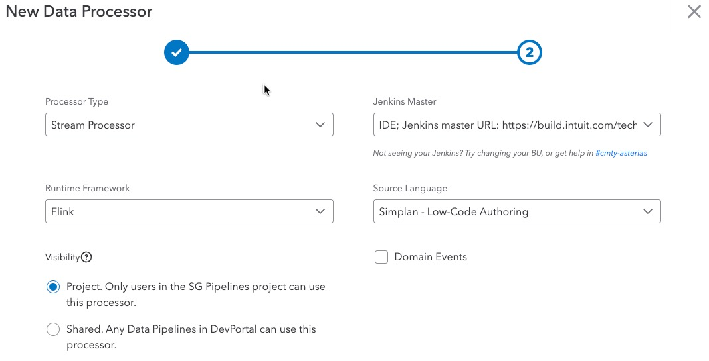

# Getting Started

Simplan Flink is available as a paved path solution integrated with Stream Processing Platform. 

To get started, please follow the instructions below.
## Create a new Processor
Go to [Dev Portal](https://devportal.intuit.com/) and create a new [Data Processor](https://devportal.intuit.com/app/dp/createResource?resourceType=dataProcessor). 

In the second screen of the wizard, select

* Processor Type as `Stream Processor`
* Runtime Framework as `Flink`
* Source Language as `Simplan - Low code authoring`

